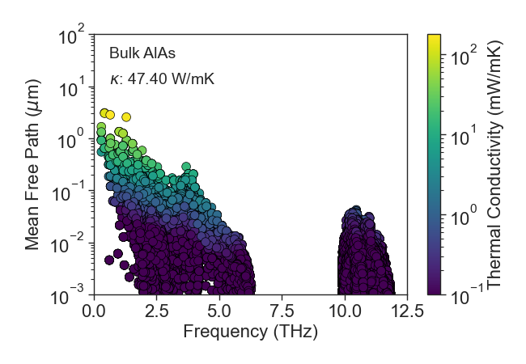
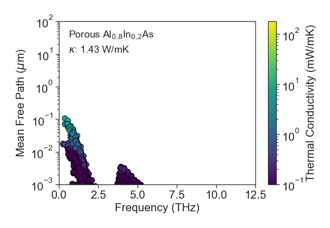

# Universal-Effective-Medium-Theory

 
The ability to tune phonon transport through nanoscale engineering holds promises for thermal management and energy conversion applications. At the nanoscale, phonon-mediated thermal transport significantly deviates from the bulk diffusive scheme. Therefore, predicting thermal conductivity in the non-diffusive regime requires models, such as the Boltzmann transport equation (BTE), that capture phonons' size effects. Although the BTE is robust and has been well validated against several key experiments, its applicability is computationally expensive. Thus, several analytical models have been put forward to estimate the effective thermal conductivity in low length scales. These methods are mostly based on simplified material descriptions such as gray-medium approximation; Assuming mean-free-path (MFP) independent population of phonons leads to an inaccurate description of phonons' behavior in nanostructured materials. To fill this gap, we developed the reduced-order closed-form ''Ballistic Correction Model'' (BCM) that takes into account the whole spectrum of MFP distribution and describes the reduction in thermal conductivity due to the size effects with effective Knudsen number. We used the BCM model to compute the thermal conductivity of thin films, nanowires, and bulk materials with nanoscale porosity. We validate our approach, against BTE-informed simulations, obtaining excellent agreement. Providing a simple yet accurate estimation of thermal transport in thin films, our work sets out to accelerate the discovery of materials for energy-conversion and thermal-management applications.
  
 

- [GETTING STARTED](#GETTING-STARTED)
- [INSTALLATION](#INSTALLATION)
- [CAPACITY](#CAPACITY)
  * [The Enhancement to Thermoelectric Performance That Could Be Obtained by Designing the Electron Scattering to Optimally Harness the Mechanism of Electron Energy Filtering](#The-Enhancement-to-Thermoelectric-Performance-That-Could-Be-Obtained-by-Designing-the-Electron-Scattering-to-Optimally-Harness-the-Mechanism-of-Electron-Energy-Filtering)
  * [Design the Nanoscale Morphology of a Thermoelectric to Obtain Favorable Electron Scattering](#Design-the-Nanoscale-Morphology-of-a-Thermoelectric-to-Obtain-Favorable-Electron-Scattering)
- [THEORY](#THEORY)
  * [Model Electron Transport Coefficients In Bulk Thermoelectrics](#Model-Electron-Transport-Coefficients-In-Bulk-Thermoelectrics)
  * [Model Fermi Level](#Model-Fermi-Level)
  * [Model Electron Lifetime](#Model-Electron-Lifetime)
  * [Model Electron Transport Coefficients in Nanostructured Thermoelectrics](#Model-Electron-Transport-Coefficients-in-Nanostructured-Thermoelectrics)
- [CASE STUDY SI BASED NANOCOMPOSITE](#CASE-STUDY-SI-BASED-NANOCOMPOSITE)
  * [Silicon Band Structure](#Silicon-Band-Structure)
  * [Model Prediction for Bulk Si](#Model-Prediction-for-Bulk-Si)
  * [Ideal Electron Filtering](#Ideal-Electron-Filtering)
  * [Effect of Nanopores on Lorenz Number](#Effect-of-Nanopores-on-Lorenz-Number)
- [REFERENCES](#REFERENCES)
- [CITATION](#Citation)

# Geetting Started

The overall structure of the repository is as below.
    
    ├── Examples             # Tutorials, sanity and performance checks
    ├── Figures              # List of figures generated by Thermoelectric.py
    ├── ThirdPartyTools      # Thirs party tools used in this project
    ├── docs                 # The pdf manual of Thermoelectric.py
    ├── src                  # Python source files of the project 
    ├── requirements.txt 
    └── README.md
  

# Theory

 

To begin, we lay out the theoretical basis for the Ballistic Correction Model (BCM). The starting point of the BCM model is to approximate the normalized cumulative thermal conductivity as 

and 

These logistic function approximations (on a log scale abscissa) hold for most of materials and simple geometries. Here, λo is the characteristic MFP showing the medium MFP of phonon distribution, Lw_w is the average phonon line-of-sight to the geometric centers and S(0) is the macroscopic suppression function equal to S(0) = κf/κb, where κf is the Fourier's prediction of the effective thermal conductivity. The BCM model predicts:

where the correction term, Ξ, that accounts for truncation of long MFP phonons, is given by

with the Knudsen number Kn=λo/Lw. For Kn = 1, we have κFILM = 1/2κBULK. For Kn → 0, Ξ → 1, recovering the diffusive regime. For large Kn, i.e., in the ballistic regime, Ξ ≈ Ln(Kn)/Kn.

 

# Model Validation

The Boltzmann transport equation (BTE) is a robust mathematical tool to conceive thermal conductivity in the (non)diffusive regime. Thus we validated the BCM model against a set of simulations performed using the BTE solver AlmaBTE.~\cite{carrete2017almabte} The development and validation of AlmaBTE with experimental data have been established in the literature through a series of publications over the last years. The phonon dispersions and the scattering rates were computed on at least a 30 by 30 by 30 points Brillouin zone mesh sampling; the second and third-order interatomic force constants for bulk materials, computed with density functional theory and using the virtual crystal approximation, are obtained from the AlmaBTE materials database.

 

 

 

 

 

 

 

 

# Phonon Bandpass Filtering in Bulk Alloys with Nanoscale Porosity

The lattice thermal conductivity of alloys is generally determined by a combination of phonon-phonon Umklapp and mass disorder scatterings. The three-phonon scattering processes strongly rely on stiffness matrix and anharmonic bonding, while the mass disorder relies on the difference in the atomic mass of compounds. The mass mismatch strongly scatters phonons with short wavelengths near the Brillouin zone edge with negligible detriment to phonons with long wavelengths near the center of the Brillouin zone. The additive nanoscale porosity limits propagation of long-MFP phonons near the Brillouin zone center, thus, alloys with nanoscale porosity imprint ultra-low thermal conductivity and suppressed phonons distribution across the frequency spectrum. Thus, the central strategy behind the phonon's band-pass filtering is to selectively scatter phonons within specific frequency ranges. Following figures show band-pass filtering through additive point defect alloys and nanoscale porosity in AlAs from first-principles calculations. High-frequency low-wavelength optical phonons are completely filtered out and the acoustic phonons (except for the ones near the Brillouin zone center) are strongly suppressed due to mass-disorder scattering. The reduction in thermal conductivity exceeds 90%. More than 70% reduction in lattice thermal conductivity through filtering long-MFP short-wavelength phonons is observed. As aforementioned, long-wavelength phonons do not see the pores in bulk AlAs with ϕ = 0.25 and L = 100 nm. Phonons across the whole frequency spectrum are strongly suppressed leading to about 97% reduction in thermal conductivity in the alloys with nanoscale porosity. Such an extreme reduction in thermal conductivity is due to the interplay between phonon-boundary and phonon mass mismatch scatterings. 

Bulk AlAs at 500K

 

 
Bulk AlAs with ϕ = 0.25 and L = 100 nm at 500K

 

 
Bulk Al0.8In0.2As at 500K

 

 
Bulk Al0.8In0.2As with ϕ = 0.25 and L = 100 nm at 500K

 

 

# Characteristic MFP of Alloys — Group-IV and Group III-V  

The characteristic MFP and bulk thermal conductivity of wide sweep of IV and III-V dielectrics at different temperatures.

AlGaAs alloys

 

 
AlGaN alloys

 

 
AlInAs alloys

 

 
GeSn alloys

 

 
InGaP alloys

 

 
SiGe alloys

 

 
SiSn alloys

 

 

# Lattice Thermal Conductivity

The lattice thermal conductvity and phonon scattering in Group III-V 

 

 

The lattice thermal conductvity and phonon scattering in Group-IV 

 

 

# Table of Lattice Thermal Conductivity, Charractristic MFP and Diffusive Suppression

 

 

